# ASIX1_0373_A00_IntroGitHub
## Primer repositorio en ASIX1 del curso 25-26 en la aplicacion
### Es primera toma de contacto con github
#### Soy Martí Pidemunt

<h2 id="descripcion-repositorio">Index del repositorio</h2>

<p>
Este repositorio contiene apuntes y ejemplos prácticos sobre:
</p>

<ul>
<li>Uso de Git y GitHub</li>
<li>Creación de README con Markdown</li>
<li>Estructura básica de HTML</li>
<li>Uso de etiquetas HTML</li>
<li>Formularios y tablas</li>
<li>Publicación de páginas con GitHub Pages</li>
</ul>

<hr>

<h2 id="indice">Índice</h2>

<ul>
<li><a href="#markdown">Markdown</a></li>
<li><a href="#comandos-git">Comandos de git</a></li>
<li><a href="#git">Git y GitHub</a></li>
<li><a href="#html">Introducción a HTML</a></li>
<li><a href="#formularios">Formularios</a></li>
<li><a href="#tablas">Tablas</a></li>
<li><a href="#pages">GitHub Pages</a></li>
<li><a href="#estructura">Estructura del proyecto</a></li>
</ul>

<hr>

<h2 id="markdown">Markdown</h2>

<a href="./imagenes/imagen_random.jpg">Enlace a imagen</a>
Esto está en __negrita__
Esto está en **negrita**

Esto está en _cursiva_
Esto está en *cursiva*

__*TEXTO*__
**__TEXTO__**

ABRIR ETIQUETA 1
     ABRIR ETIQUETA 2
        contenido
     CERRAR ETIQUETA 2
CERRAR ETIQUETA 1

1. Elemento 
    * Elemento desordenado 1.1
    * Elemento desordenado 1.2
2. Elemento 2
    * Elemento desordenado 2.1
    * Elemento desordenado 2.2
3. Elemento 3
    * Elemento desordenado 3.1
    * Elemento desordenado 3.2

* Elemento desordenado 1
* Elemento desordenado 2
* Elemento desordenado 3

<p>Esto es un parrafo</p>

[link](https://stackoverflow.com/questions/41345160/display-link-url-in-markdown/ "Manual oficial de Markdown")


| *Jugador* | Equipo | Nombre |
|------------:|:---------------:|:--------------|
| 32 | Lakers | Magic Jonhson |
| 33 | Celtics | Larry Bird |
| 23 | Bulls | Michael Jordan |

<h2 id="comandos-git">Comandos de git</h2>

# Inicializa repositorio
git init
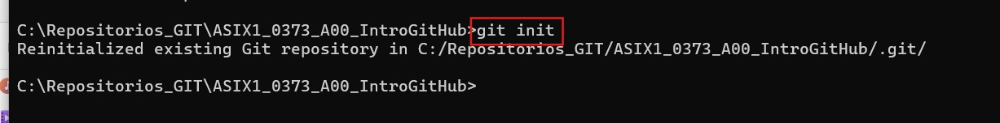

# Añade archivos al staging
git add .
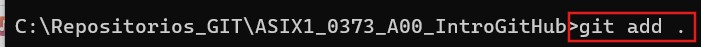

# Guarda cambios
git commit -m "Añadidas líneas al README"
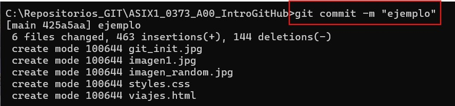

# Sube cambios a GitHub
git push origin main
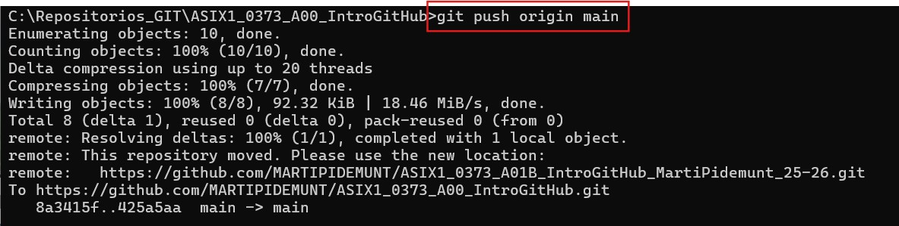

# Clonar repositorio
git clone https://github.com/usuario/repositorio.git
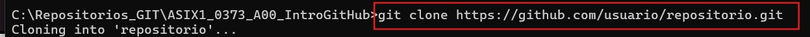

<!DOCTYPE html>
<html lang="es">

<head>
<meta charset="UTF-8">
<title>Apuntes Markdown y GitHub</title>
<link rel="stylesheet" href="./css/markdown.css">

</head>

<body>

<h1>Apuntes completos</h1>

<section>

<!-- Comentario: Encabezados Markdown -->

<h2>Etiquetas básicas de Markdown</h2>

<h3>Encabezados</h3>

<p>Sirven para organizar documentos.</p>

<pre>
# H1
## H2
### H3
#### H4
##### H5
###### H6
</pre>

<!-- Comentario: Estilos de texto Markdown -->

<h3>Estilos de letra</h3>

<ul>
<li>Cursiva : *texto* o _texto_</li>
<li>Negrita : **texto** o __texto__</li>
<li>Tachado : ~~palabra~~</li>
<li>Anidar estilos : **palabra1 _palabra2_**</li>
</ul>

</section>

<section>

<!-- Comentario: Enlaces Markdown -->

<h3>Enlaces</h3>

<pre>
[Link](https://google.com/ "Título opcional")
</pre>

<p>Texto entre corchetes : texto visible</p>
<p>Texto entre paréntesis : dirección del enlace</p>

</section>

<section>

<!-- Comentario: Tablas Markdown -->

<h3>Tablas Markdown</h3>

<table>

<tr>
<th>Tables</th>
<th>Are</th>
<th>Cool</th>
</tr>

<tr>
<td>col 3 is</td>
<td>centered</td>
<td>1600</td>
</tr>

<tr>
<td>col 2 is</td>
<td>centered</td>
<td>12</td>
</tr>

</table>

</section>

<section>

<!-- Comentario: Listas verificación Markdown -->

<h3>Listas verificación</h3>

<ul>
<li>☐ A</li>
<li>☑ B</li>
<li>☐ C</li>
</ul>

</section>

<section>

<!-- Comentario: Crear repositorio GitHub -->

<h2 id="git">Crear repositorio GitHub</h2>
<ol>

<li>Entrar en https://github.com</li>
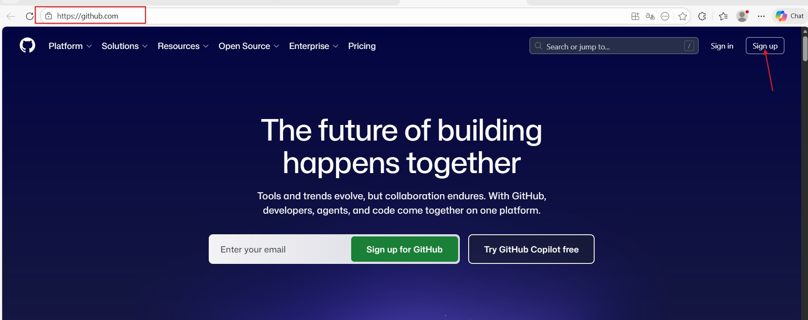
<li>Crear cuenta</li>
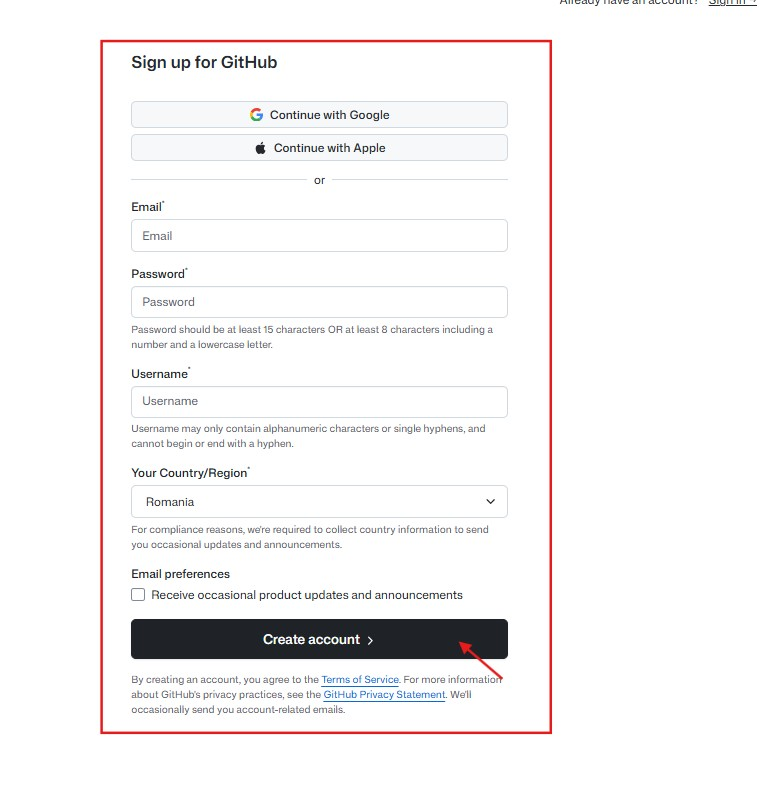
<li>Crear repositorio nuevo</li>
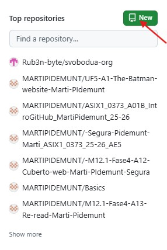
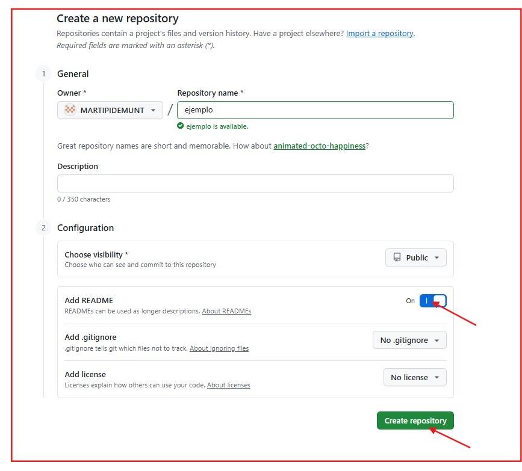
</ol>


</section>

<section>

<!-- Explicación de GitHub creacion Pages -->
<h2 id="pages">GitHub Pages</h2>

<p>
GitHub Pages : servicio de GitHub que permite publicar páginas web gratis usando repositorios.
</p>

<!-- Comentario: Requisitos para usar GitHub Pages -->

<h3>Requisitos</h3>

<ul>
<li>Tener cuenta en GitHub</li>
<li>Tener repositorio creado</li>
<li>Tener archivo index.html</li>
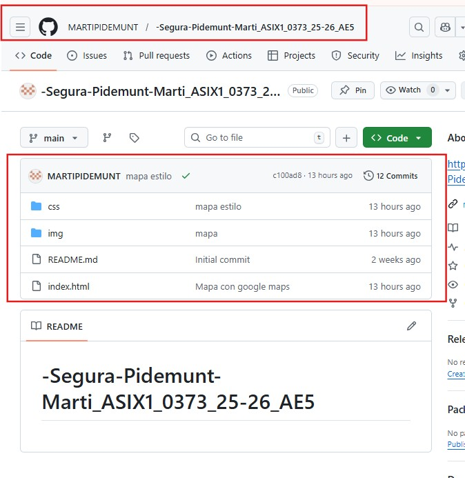

</ul>

<!-- Comentario: Pasos para crear GitHub Pages -->

<h3>Pasos para crear una página web con GitHub Pages</h3>

<ol>

<li>Entrar en el repositorio</li>
<li>Ir a Settings</li>
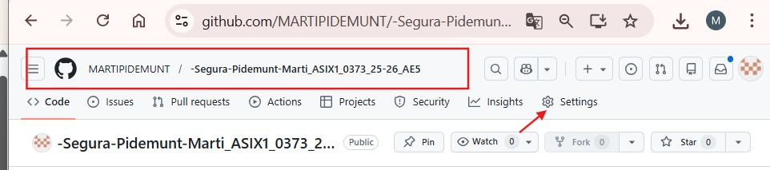

<li>Entrar en Pages</li>
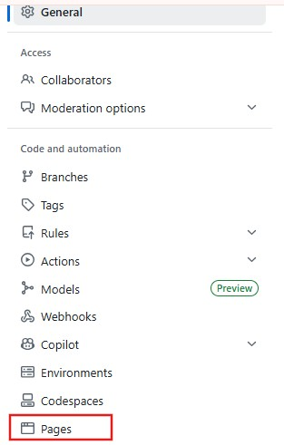
<li>En Source seleccionar :
Branch : main  
Folder : root  
</li>

<li>Guardar cambios</li>
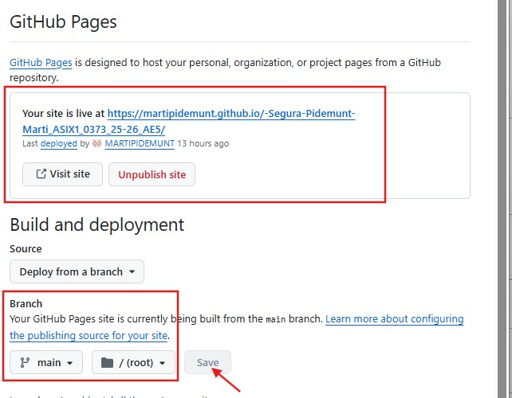
</ol>

<!-- Sección dirección web -->

<section id="direccion-web">

<!-- Explica la URL generada por GitHub Pages -->

<h3 id="titulo-direccion">Dirección de la página web</h3>

<p>GitHub genera una URL con formato :</p>

<p>Ejemplo :</p>

<pre>
https://martipidemunt.github.io/ASIX1_0373_A00_IntroGitHub
</pre>

</section>

<!-- Introducción HTML -->

<section id="introduccion-html">

<!-- Explica qué es HTML -->

<h2 id="html">Introducción a HTML</h2>

<p>HTML : lenguaje estándar para crear páginas web.</p>

<h3 id="significado-html">Significado HTML</h3>

<ul>
<li>HyperText : enlaza contenidos</li>
<li>Markup : utiliza etiquetas</li>
<li>Language : sigue normas</li>
</ul>

</section>

```html
<!DOCTYPE html>
<!-- Define el tipo de documento HTML5 -->

<html lang="es">
<!-- Idioma del documento -->

<head>
<meta charset="UTF-8">
<!-- Permite usar caracteres especiales -->

<meta name="viewport" content="width=device-width, initial-scale=1.0">
<!-- Hace la web adaptable a móviles -->

<title>Primera pagina</title>
</head>

<body>

<a href="#imagen1">Enlace a Imagen uno</a>
<!-- Enlace interno dentro de la página -->

<h1>Hola mundo</h1>
<!-- Encabezado principal -->

<h2>Mi primera pagina web</h2>

<p>Lorem ipsum dolor sit amet...</p>
<!-- Párrafo -->

<br>
<!-- Salto de línea -->

<hr>
<!-- Línea separadora -->

<p><em>Texto enfatizado</em></p>
<!-- Texto en cursiva -->

<p><strong>Texto importante</strong></p>
<!-- Texto con importancia semántica -->

<ol>
<!-- Lista ordenada -->

<li>Primer elemento
    <ol>
        <li>SubElemento 1.1</li>
        <li>SubElemento 1.2</li>
    </ol>
</li>

</ol>

<ul>
<!-- Lista desordenada -->

<li>Elemento</li>

</ul>


<!-- Imagen con identificador -->
```
<a href="https://martipidemunt.github.io/ASIX1_0373_A01B_IntroGitHub_MartiPidemunt_25-26/viajes.html">Enlace otra pagina Viajes</a>
<!-- Enlace a otra página -->

</body>
</html>

<!-- Tablas HTML -->

<section id="tablas-html">


<!DOCTYPE html>
<html lang="en">
<head>
    <meta charset="UTF-8">
    <meta name="viewport" content="width=device-width, initial-scale=1.0">
</head>
<body>
<!-- Ejemplo de tabla -->

<h2 id="tablas">Tablas HTML</h2>
<table border="1">
<!-- Tabla con borde -->

<h2>Tabla Clasificatoria Maratón BCN</h2>
<!-- Título de la tabla -->

<thead>
<!-- Encabezado tabla -->
<tr>
<th>ORDEN</th>
<th>ATLETA</th>
<th>TIEMPO</th>
</tr>
</thead>

<tbody>
<!-- Cuerpo tabla -->

<tr>
<td>1</td>
<td>Michel Eaton</td>
<td>2:23:00</td>
</tr>

<tr>
<td rowspan="2">2</td>
<!-- Une filas -->
<td colspan="2">Andrea Bocelli</td>
<!-- Une columnas -->
</tr>

</tbody>
</table>

</body>
</html>
<!-- Elementos HTML -->

<section id="elementos-html">

<!-- Explica cómo se forma un elemento HTML -->

<h3 id="estructura-elemento">Elementos HTML</h3>

<ul>
<li>Etiqueta apertura : &lt;p&gt;</li>
<li>Contenido : texto o elementos</li>
<li>Etiqueta cierre : &lt;/p&gt;</li>
</ul>

<pre>
&lt;p&gt;Contenido&lt;/p&gt;
</pre>

</section>


<!-- Atributos HTML -->

<section id="atributos-html">

<!-- Muestra cómo funcionan los atributos -->

<h3 id="atributos">Atributos HTML</h3>

<pre>
&lt;p class="editor-note"&gt;Texto&lt;/p&gt;
</pre>

<p>class : nombre del atributo</p>
<p>editor-note : valor del atributo</p>

</section>


<!-- Estructura básica HTML -->

<section id="estructura-basica">

<!-- Plantilla básica de una página HTML -->

<h2 id="estructura">Estructura básica HTML</h2>

<pre>
&lt;!DOCTYPE html&gt;
&lt;html&gt;
&lt;head&gt;
&lt;title&gt;Página&lt;/title&gt;
&lt;/head&gt;
&lt;body&gt;
Contenido
&lt;/body&gt;
&lt;/html&gt;
</pre>

<p>DOCTYPE : tipo documento</p>
<p>html : elemento raíz</p>
<p>head : metadatos</p>
<p>body : contenido visible</p>

</section>


<!-- Listas HTML -->

<section id="listas-html">

<!-- Ejemplos de listas -->

<h2 id="listas">Listas HTML</h2>

<h3 id="lista-desordenada">Lista desordenada</h3>

<ul>
<li>Elemento 1</li>
<li>Elemento 2</li>
</ul>

<h3 id="lista-ordenada">Lista ordenada</h3>

<ol>
<li>Elemento A</li>
<li>Elemento B</li>
</ol>
</section>

<!-- Rutas HTML -->
<section id="rutas-html">

<!-- Explica rutas absolutas y relativas -->

<h2 id="rutas">Rutas</h2>

<h3 id="ruta-absoluta">Ruta absoluta</h3>

<p>/imagenes/Google_logo.jpg</p>

<pre>
&lt;img src="/imagenes/Google_logo.jpg"&gt;
</pre>

<h3 id="ruta-relativa">Ruta relativa</h3>

<p>./imagenes/Google_logo.jpg</p>

<pre>
&lt;img src="./imagenes/Google_logo.jpg"&gt;
</pre>

</section>


<!-- Enlaces HTML -->

<section id="enlaces-html">

<!-- Ejemplos de enlaces -->

<h2 id="enlaces">Enlaces</h2>

<p><a href="https://google.com">Enlace externo</a></p>

<p><a href="./index.html">Enlace interno</a></p>

</section>

<h2 id="formularios">Formularios</h2>

<!-- Formularios HTML -->
```html
<section id="formularios-html">

<!-- Ejemplo completo de formulario -->

<form>

<label>Nombre :</label>
<input type="text">

<br>

<label>Email :</label>
<input type="email">

<br><br>

<!-- Campo obligatorio -->
<label>Username :</label>
<input type="text" name="username" required>

<h3 id="checkbox">Checkbox</h3>

<label><input type="checkbox"> Deportes</label>
<label><input type="checkbox"> Música</label>

<!-- Agrupa opciones relacionadas -->
<fieldset>

<legend>Carnet conducir</legend>

<label><input type="radio" name="carnet" value="si"> SI</label>
<label><input type="radio" name="carnet" value="no"> NO</label>

</fieldset>

<br>

<!-- Lista desplegable -->
<select name="Nacionalidad">
<option>España</option>
<option>Peru</option>
</select>

<br><br>

<!-- Área para texto largo -->
<textarea rows="5"></textarea>

<br><br>

<button type="submit">Enviar</button>

</form>

<!-- Enlace a otra página -->
<p><a href="./formularios.html">Formularios</a></p>
```
https://martipidemunt.github.io/ASIX1_0373_A01B_IntroGitHub_MartiPidemunt_25-26/formularios.html
</section>

<br>
<html>
<h1 id="asix">ASIX1 – Apuntes CSS</h1>
<h1 id="apuntes-css">Apuntes CSS</h1>
<a href="https://martipidemunt.github.io/ASIX1_0373_A01B_IntroGitHub_MartiPidemunt_25-26/apuntes_css.html">Enlace pagina ejemplo</a>
<h2 id="intro">Evolución, sintaxis y diseño web responsive</h2>

<ul>
<li><a href="#asix">ASIX1 – Apuntes CSS</a></li>
<li><a href="#apuntes-css">Apuntes CSS</a></li>
<li><a href="#intro">Introducción</a></li>
<li><a href="#evolucion-funcion">CSS Evolución y función</a></li>
<li><a href="#origen-css">Origen de CSS</a></li>
<li><a href="#funcion-lenguajes">Función de cada lenguaje</a></li>
<li><a href="#css-no-es">CSS no es</a></li>
<li><a href="#historia-css">Historia de CSS</a></li>
<li><a href="#ventajas-inconvenientes">Ventajas e inconvenientes CSS</a></li>
<li><a href="#ubicacion-css">Ubicación de CSS</a></li>
<li><a href="#prioridad-css">Prioridad CSS</a></li>
<li><a href="#sintaxis-css">Sintaxis CSS</a></li>
<li><a href="#selectores-css">Selectores CSS</a></li>
<li><a href="#modelo-caja">Modelo de Caja CSS</a></li>
<li><a href="#posicionamiento-css">Posicionamiento CSS</a></li>
<li><a href="#flexbox">Flexbox</a></li>
<li><a href="#responsive">Diseño Responsive</a></li>
<li><a href="#ejemplo-completo">Ejemplo completo CSS</a></li>
<li><a href="#conclusion">Conclusión</a></li>
</ul>

<hr>

<h1 id="evolucion-funcion">CSS Evolución y función</h1>

<p>CSS (Cascading Style Sheets) es el lenguaje que permite definir la apariencia visual de las páginas web.</p>

<hr>

<h2 id="origen-css">Origen de CSS</h2>

<p>En los inicios de Internet:</p>

<ul>
<li>HTML era muy simple</li>
<li>Solo permitía contenido textual</li>
<li>Se añadieron etiquetas visuales</li>
<li>HTML empezó a mezclar estructura y diseño</li>
</ul>

<p>Para solucionar este problema se creó CSS.</p>

<hr>

<h2 id="funcion-lenguajes">Función de cada lenguaje</h2>

<h3 id="funcion-html">HTML</h3>
<ul>
<li>Define la estructura del documento</li>
<li>Define el significado del contenido</li>
<li>Ejemplos : títulos, enlaces, párrafos</li>
</ul>

<h3 id="funcion-css">CSS</h3>
<ul>
<li>Define la apariencia visual</li>
<li>Define colores, tamaños y posiciones</li>
<li>Define espaciados</li>
</ul>

<hr>

<h2 id="css-no-es">CSS no es</h2>

<ul>
<li>Lenguaje de programación como JavaScript</li>
<li>Lenguaje de etiquetas como HTML</li>
</ul>

<hr>

<h1 id="historia-css">Historia de CSS</h1>

<ul>
<li>1994 : Propuesta CHSS creada por Håkon Wium Lie</li>
<li>1996 : CSS Level 1 se convierte en estándar</li>
<li>1998 : CSS Level 2</li>
<li>2008 : CSS 2.1 revisión</li>
<li>Actualidad : CSS3 dividido en módulos independientes</li>
</ul>

<hr>

<h1 id="ventajas-inconvenientes">Ventajas e inconvenientes CSS</h1>

<h2 id="ventajas-css">Ventajas</h2>

<ul>
<li>Código más limpio</li>
<li>Separación estructura y diseño</li>
<li>Reutilizable en varias páginas</li>
<li>Permite diseños más complejos</li>
<li>Permite estilos diferentes según dispositivo</li>
<li>Fácil mantenimiento</li>
</ul>

<h2 id="inconvenientes-css">Inconvenientes</h2>

<ul>
<li>Diferencias entre navegadores</li>
<li>Necesidad de pruebas adicionales</li>
</ul>

<hr>

<h1 id="ubicacion-css">Ubicación de CSS</h1>

<p>CSS puede aplicarse de tres formas.</p>

<h2 id="inline">Estilo Inline</h2>

<pre>
&lt;p style="color:red"&gt;Texto rojo&lt;/p&gt;
</pre>

<h2 id="interno">Estilo Interno</h2>

<pre>
&lt;style&gt;
p {
color:red;
}
&lt;/style&gt;
</pre>

<h2 id="externo">Estilo Externo</h2>

<p>HTML</p>

<pre>
&lt;link rel="stylesheet" href="./css/styles.css"&gt;
</pre>

<p>CSS</p>

<pre>
p {
color:red;
}
</pre>

<hr>

<h1 id="prioridad-css">Prioridad CSS</h1>

<p>Cuando varias reglas afectan a un elemento:</p>

<ul>
<li>Inline</li>
<li>Interno</li>
<li>Externo</li>
</ul>

<h2 id="especificidad">Especificidad</h2>

<ul>
<li>Inline : 1000</li>
<li>ID : 100</li>
<li>Clase : 10</li>
<li>Elemento : 1</li>
</ul>

<p>Ejemplo</p>

<ul>
<li>h1: 1</li>
<li>.box: 10</li>
<li>#main: 100</li>
</ul>

<h2 id="important">Important</h2>

<pre>
color:red !important;
</pre>

<h2 id="herencia">Herencia</h2>

<ul>
<li>color</li>
<li>font-family</li>
</ul>

<hr>

<h1 id="sintaxis-css">Sintaxis CSS</h1>

<h2 id="estructura-css">Estructura</h2>

<pre>
selector {
propiedad: valor;
}
</pre>

<h2 id="ejemplo-css">Ejemplo</h2>

<pre>
p {
font-size: 12px;
color: blue;
}
</pre>

<h2 id="comentarios-css">Comentarios CSS</h2>

<pre>
/* Comentario CSS */
</pre>

<h2 id="agrupar-selectores">Agrupar selectores</h2>

<pre>
h1, p {
color:red;
}
</pre>

<hr>

<h1 id="selectores-css">Selectores CSS</h1>

<h2 id="selectores-basicos">Selectores básicos</h2>

<h3 id="selector-elemento">Selector de elemento</h3>

<pre>
a {
color:red;
}
</pre>

<h3 id="selector-id">Selector ID</h3>

<pre>
#ejemplo {
color:blue;
}
</pre>

<p>Solo puede existir un ID igual.</p>

<h3 id="selector-clase">Selector clase</h3>

<pre>
.ejemplo {
color:green;
}
</pre>

<p>Puede repetirse en varios elementos.</p>

<hr>

<h2 id="selectores-avanzados">Selectores avanzados</h2>

<h3 id="selector-universal">Selector universal</h3>

<pre>
* {
border:1px solid black;
}
</pre>

<h3 id="selector-atributos">Selectores de atributos</h3>

<pre>
img[alt] {
border:1px solid black;
}
</pre>

<h3 id="selector-hijos">Selectores hijos directos</h3>

<pre>
div &gt; p {
color:red;
}
</pre>

<h3 id="selector-descendientes">Selectores descendientes</h3>

<pre>
div p {
color:blue;
}
</pre>

<h3 id="selector-hermanos">Selectores hermanos adyacentes</h3>

<pre>
h1 + h2 {
margin-top:-5px;
}
</pre>

<hr>

<h2 id="pseudoclases">Pseudoclases</h2>

<ul>
<li>:link</li>
<li>:visited</li>
<li>:hover</li>
<li>:focus</li>
</ul>

<h2 id="pseudoelementos">Pseudoelementos</h2>

<pre>
p::first-line {
color:red;
}
</pre>

<hr>

<h1 id="modelo-caja">Modelo de Caja CSS</h1>

<p>Todos los elementos HTML funcionan como una caja.</p>

<h2 id="margin">Margin</h2>

<ul>
<li>margin-top</li>
<li>margin-right</li>
<li>margin-bottom</li>
<li>margin-left</li>
</ul>

<p>Valores posibles</p>

<ul>
<li>px</li>
<li>em</li>
<li>rem</li>
<li>%</li>
<li>auto</li>
</ul>

<h2 id="border">Border</h2>

<pre>
border:2px solid red;
</pre>

<h3 id="tipos-borde">Tipos de borde</h3>

<ul>
<li>solid</li>
<li>dashed</li>
<li>dotted</li>
<li>double</li>
<li>groove</li>
<li>ridge</li>
<li>inset</li>
<li>outset</li>
</ul>

<h2 id="padding">Padding</h2>

<ul>
<li>padding-top</li>
<li>padding-right</li>
<li>padding-bottom</li>
<li>padding-left</li>
</ul>

<p>Nunca puede ser negativo.</p>

<h3 id="padding-abreviado">Forma abreviada</h3>

<pre>
padding:10px;
padding:10px 20px;
padding:10px 20px 5px;
padding:10px 20px 5px 15px;
</pre>

<hr>

<h1 id="posicionamiento-css">Posicionamiento CSS</h1>

<h2 id="display-block">Display block</h2>

<ul>
<li>Ocupa todo el ancho</li>
<li>Salta línea automáticamente</li>
</ul>

<h2 id="box-sizing">Box-sizing</h2>

<p>content-box : padding y border fuera del tamaño</p>

<pre>
box-sizing:border-box;
</pre>

<p>border-box : padding y border dentro del tamaño</p>

<h2 id="overflow">Overflow</h2>

<pre>
overflow:hidden;
overflow:scroll;
overflow:auto;
</pre>

<h2 id="text-overflow">Text overflow</h2>

<pre>
text-overflow:ellipsis;
</pre>

<hr>

<h1 id="flexbox">Flexbox</h1>

<h2 id="conceptos-flexbox">Conceptos</h2>

<ul>
<li>Contenedor : elemento padre</li>
<li>Item : hijos del contenedor</li>
<li>Eje principal : dirección principal</li>
<li>Eje secundario : dirección perpendicular</li>
</ul>

<h2 id="propiedades-contenedor">Propiedades del contenedor</h2>

<pre>
display:flex;
flex-direction:row;
flex-wrap:wrap;
justify-content:center;
align-items:center;
</pre>

<h2 id="propiedades-hijos">Propiedades de los hijos</h2>

<ul>
<li>order</li>
<li>flex-grow</li>
<li>flex-shrink</li>
<li>flex-basis</li>
<li>align-self</li>
</ul>

<hr>

<h1 id="responsive">Diseño Responsive</h1>

<p>Permite adaptar la web a diferentes tamaños de pantalla.</p>

<h2 id="caracteristicas-responsive">Características</h2>

<ul>
<li>Diseño flexible</li>
<li>Media queries</li>
<li>Rejillas fluidas</li>
<li>Imágenes escalables</li>
</ul>

<h2 id="media-queries">Media Queries</h2>

<pre>
body {
background:blue;
}

@media (max-width:768px) {
body {
background:green;
}
}

@media (max-width:480px) {
body {
background:yellow;
}
}
</pre>

<hr>

<h1 id="ejemplo-completo">Ejemplo completo CSS</h1>

<pre>
body {
font-family:Arial;
margin:0;
padding:0;
}

.container {
display:flex;
justify-content:center;
align-items:center;
height:100vh;
}

.caja {
width:200px;
padding:20px;
border:2px solid black;
margin:10px;
}
</pre>

<hr>

<h1 id="conclusion">Conclusión</h1>

<ul>
<li>Separar diseño y contenido</li>
<li>Crear diseños complejos</li>
<li>Adaptar webs a distintos dispositivos</li>
<li>Reutilizar estilos</li>
<li>Mejorar mantenimiento del código</li>
</ul>
</html>
